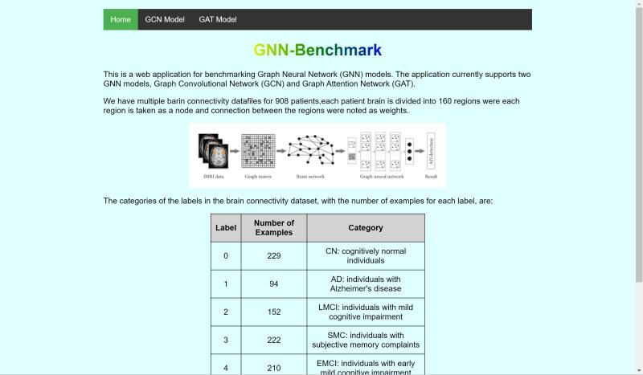

# GNN for Alzheimer's disease prediction from Diffusion Tensor Imaging Data

This project involves the implementation of a Graph Neural Network (GNN) to predict labels from a dataset derived from diffusion tensor imaging (DTI) data. Specifically, we aim to classify the graph structure into one of four categories: **AD**, **CD**, **Early Detection**, and **Late Detection**.


## Project Overview

The dataset used in this project consists of adjacency matrices, each representing a patient's DTI data. Our goal is to leverage these matrices to predict the corresponding label using a GNN.

### Key Features
- **Task**: 4-class classification (AD, CD, Early Detection, Late Detection)
- **Input Data**: Adjacency matrices derived from DTI data
- **Output**: Predicted labels for each graph

## Data Preparation

Each patient file is represented as an adjacency matrix. To process this dataset with a GNN, the adjacency matrix needs to be converted into a graph structure, comprising:

- **Nodes**
- **Edges**
- **Weights**

These components are extracted from the adjacency matrix to create the input for the GNN.

## Implementation Details

- **Model**: A GNN model tailored to handle the graph structure of the dataset.
- **Classification**: The model is trained to classify the graph data into one of the four classes: AD, CD, Early Detection, or Late Detection.

## Getting Started

### Prerequisites

Ensure you have the following installed:

- Python 3.x
- PyTorch
- DGL (Deep Graph Library) or any other GNN framework of your choice
- Additional libraries as required (NumPy, SciPy, etc.)

### Installation

Clone the repository and install the required dependencies:

```bash
git clone https://github.com/your-username/gnn-dti-classification.git
cd gnn-dti-classification
pip install -r requirements.txt


